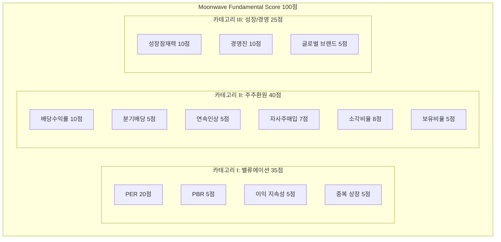
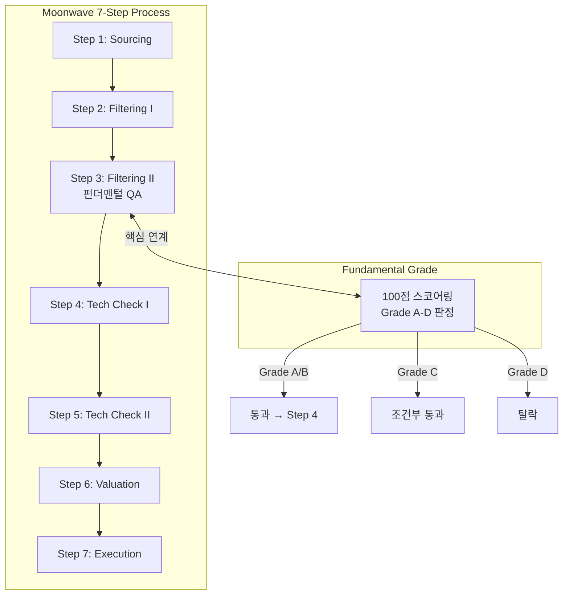
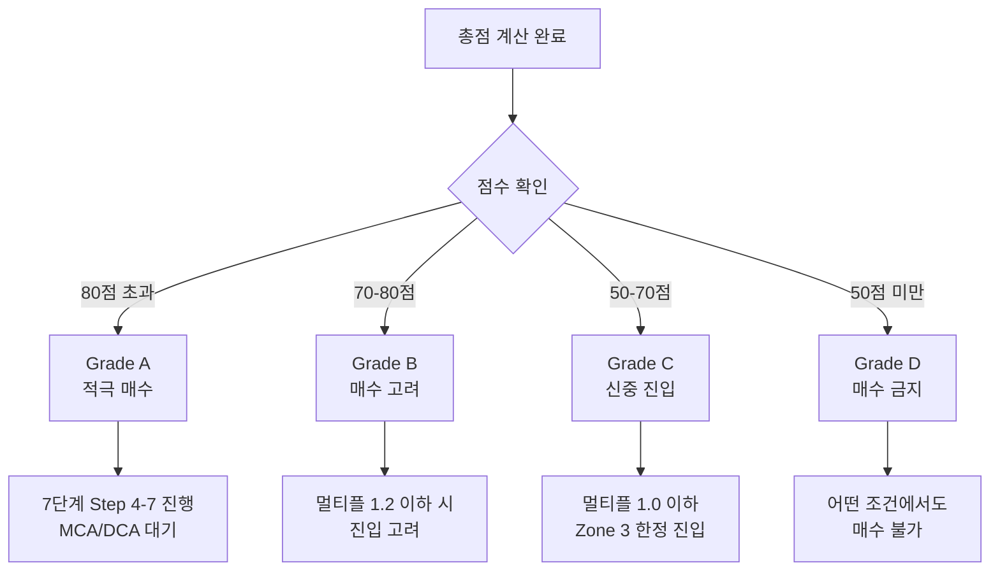
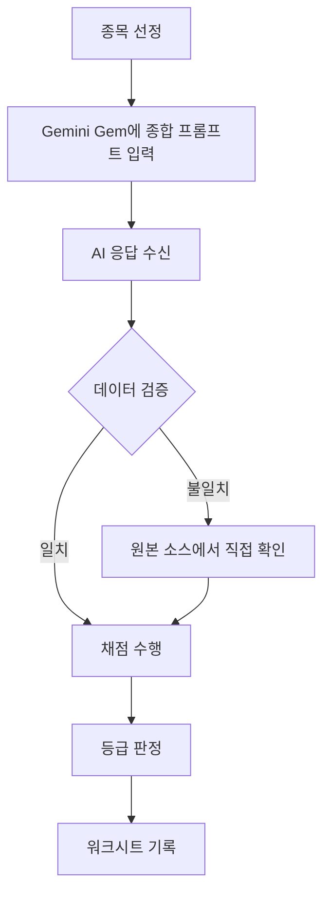
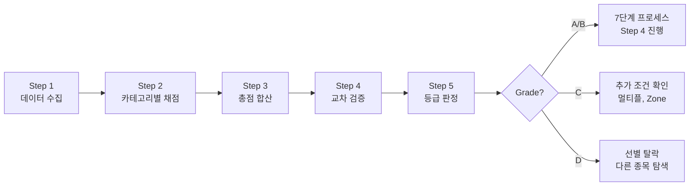

# Moonwave Fundamental Grade v2.0
## 펀더멘털 스코어링 시스템 백서

**Version**: 2.0
**Last Updated**: 2026-01-21
**Author**: Moonwave Antigravity
**Purpose**: 감정을 배제한 정량적 기업 가치 평가 시스템

---

# 0. Executive Summary (핵심 요약)

## 0.1 Fundamental Grade 한 줄 정의

> **"투자자의 직감과 막연한 기대감을 배제하고, 오직 숫자와 데이터로 기업의 가치를 검증하는 100점 만점 품질 보증(QA) 시스템"**

Moonwave Fundamental Grade는 매수 버튼을 누르기 전 반드시 거쳐야 할 **정량적 검증 절차**입니다. 감정이 아닌 데이터로 기업을 판단하십시오.

---

## 0.2 100점 구성 요약 다이어그램



---

## 0.3 Grade 판정 Quick Reference

| Grade | 점수 범위 | 판정 | 행동 지침 |
|-------|----------|------|----------|
| **A** | 80점 초과 | 적극 매수 | 저평가 + 성장 + 주주환원 삼위일체. Top Pick |
| **B** | 70-80점 | 매수 고려 | 펀더멘털 우수. 포트폴리오 편입 권장 |
| **C** | 50-70점 | 신중 진입 | 신규 매수 신중, 기존 보유자 홀딩 가능 |
| **D** | 50점 미만 | **매수 금지** | 가치 훼손 상태. 매도 또는 교체 권고 |

---

## 0.4 Quick Start: 5분 평가 가이드

| 순서 | 행동 | 데이터 소스 |
|------|------|------------|
| 1 | PER, PBR 확인 | 네이버 증권 > 종목 분석 |
| 2 | 배당수익률 & 연속성 확인 | 컴퍼니가이드 > 배당 정보 |
| 3 | 자사주 매입/소각 이력 확인 | DART 공시 시스템 |
| 4 | 경영진 리스크 판단 | 뉴스 검색 & 재무제표 |
| 5 | 총점 합산 → Grade 판정 | 본 백서 워크시트 활용 |

---

# 1. 서론 및 철학 (Introduction & Philosophy)

## 1.1 Definition Block: Moonwave Fundamental Grade

| 항목 | 내용 |
|------|------|
| **Definition** | 기업의 펀더멘털을 정량적으로 평가하여 100점 만점으로 환산하고, 투자 등급(Grade A-D)을 판정하는 시스템 |
| **Purpose** | 감정과 직감을 배제한 객관적 투자 의사결정 지원 |
| **Scoring Range** | 0-100점 (13개 평가 항목) |
| **Criteria** | 밸류에이션 35점 + 주주환원 40점 + 성장/경영 25점 |
| **Output** | Grade A/B/C/D 등급 및 투자 행동 지침 |

---

## 1.2 "감정을 제거하는 도구"의 의미

### 투자 실패의 근본 원인

대부분의 투자 실패는 **감정**에서 비롯됩니다:

| 감정 | 발생 상황 | 결과 |
|------|----------|------|
| **탐욕** | 급등 종목 발견 | 고점 추격 매수 → 물림 |
| **공포** | 급락 시장 | 바닥 투매 → 손실 확정 |
| **희망** | 하락 종목 보유 | 손절 미루기 → 대형 손실 |
| **후회** | 매도 후 추가 상승 | 재매수 FOMO → 악순환 |

### Fundamental Grade의 해결책

> "좋아 보인다"는 느낌 대신, 위 체크리스트를 통해 산출된 **점수만을 믿으십시오.**

- 감정 → 숫자로 대체
- 직감 → 데이터로 검증
- 희망 → 체크리스트로 판단

---

## 1.3 7단계 선별 프로세스와의 관계 (Step 3 연계)



### 연계 규칙

| 등급 | 7단계 프로세스 대응 |
|------|-------------------|
| **Grade A** | Step 4로 무조건 진행 |
| **Grade B** | Step 4로 진행. 멀티플 1.2 이하 시 적극 고려 |
| **Grade C** | Step 4 진행 가능. 단, 멀티플 1.0 이하 + Zone 3 한정 |
| **Grade D** | **즉시 탈락**. Step 4 진행 불가 |

---

## 1.4 숫자만 믿으라: 정량 평가의 원칙

### 3가지 핵심 원칙

1. **측정 가능한 것만 평가한다**
   - 추상적 개념(예: "좋은 회사")은 배제
   - 수치화 가능한 지표만 채점

2. **일관된 기준을 적용한다**
   - 모든 종목에 동일한 기준 적용
   - 예외를 허용하지 않음

3. **결과를 존중한다**
   - Grade D 종목은 아무리 차트가 예뻐도 매수 금지
   - 점수가 낮으면 이유를 찾지 말고 다음 종목으로

---

## 1.5 Fundamental Grade 선언문

> "나는 기업의 가치를 판단할 때,
>
> 뉴스의 헤드라인이 아닌 **재무제표의 숫자**를 본다.
> 타인의 추천이 아닌 **나의 체크리스트**를 믿는다.
> 막연한 기대가 아닌 **검증된 데이터**에 투자한다.
>
> 50점 미만 종목은 절대 매수하지 않는다.
> 이것이 나의 **Fundamental Grade 원칙**이다."

---

# 2. 용어 정의집 (Glossary)

## 2.1 밸류에이션 용어

| 용어 | 영문 | 정의 | 계산식 |
|------|------|------|--------|
| **PER** | Price Earnings Ratio | 주가수익비율. 주가가 순이익의 몇 배인지 | 주가 ÷ 주당순이익(EPS) |
| **PBR** | Price Book-value Ratio | 주가순자산비율. 주가가 순자산의 몇 배인지 | 주가 ÷ 주당순자산(BPS) |
| **저평가** | Undervalued | 기업의 내재가치 대비 시장가격이 낮은 상태 | PER, PBR이 업종 평균 이하 |
| **고평가** | Overvalued | 기업의 내재가치 대비 시장가격이 높은 상태 | PER, PBR이 업종 평균 초과 |

---

## 2.2 주주환원 용어

| 용어 | 정의 | 중요도 |
|------|------|--------|
| **배당수익률** | 연간 배당금 ÷ 현재 주가 × 100 | 현금 흐름 직접 반환 지표 |
| **분기 배당** | 연 4회 배당금을 지급하는 정책 | 주주친화 의지 표현 |
| **배당 연속 인상** | 연속으로 배당금을 올린 햇수 | 지속가능성 + 성장성 지표 |
| **자사주 매입** | 회사가 자기 주식을 시장에서 사들임 | 주가 부양 + 주당가치 상승 |
| **자사주 소각** | 매입한 자사주를 폐기하여 총주식수 감소 | 가장 강력한 주주환원 |
| **자사주 보유 비율** | 회사가 보유 중인 자사주 비율 | 낮을수록 좋음 (소각 완료 의미) |

---

## 2.3 성장성 용어

| 용어 | 정의 | 평가 기준 |
|------|------|----------|
| **미래 성장 잠재력** | 해당 산업의 향후 성장 가능성 | 산업 전망 보고서, 정책 동향 |
| **경쟁 우위** | 타사 대비 차별화된 경쟁력 보유 여부 | 특허, 브랜드, 시장점유율 |
| **오너 리스크** | 대주주/경영진으로 인한 투자 위험 | 횡령, 배임, 일감몰아주기 이력 |
| **전문 경영인** | 대주주가 아닌 전문 경영자가 운영 | 일반적으로 긍정적 평가 |
| **글로벌 브랜드** | 세계적으로 인지도 있는 브랜드 보유 | 수출 경쟁력 + 프리미엄 마진 |

---

## 2.4 등급 용어 (Grade A-D)

| 등급 | 점수 | 의미 | 투자 적합성 |
|------|------|------|------------|
| **Grade A** | 80점 초과 | 최우수 | 장기투자 적극 권장 |
| **Grade B** | 70-80점 | 우수 | 장기투자 적합 |
| **Grade C** | 50-70점 | 보통 | 신중한 접근 필요 |
| **Grade D** | 50점 미만 | 미달 | 투자 부적합 |

---

# 3. 투자 등급 체계 (Grading System)

## 3.1 Definition Block: 4단계 등급 체계

| 항목 | 내용 |
|------|------|
| **Definition** | Fundamental Score에 기반한 4단계 투자 적합성 분류 시스템 |
| **Purpose** | 투자 의사결정의 명확한 기준 제공 |
| **Scoring Range** | Grade A (80+) / B (70-80) / C (50-70) / D (50-) |
| **Criteria** | 총점 기준 자동 분류, 예외 없음 |
| **Output** | 매수/보유/매도 행동 지침 |

---

## 3.2 Grade A: 적극 매수 (80점 초과)

### 특징 및 기준

| 항목 | 조건 |
|------|------|
| **총점** | 80점 초과 |
| **필수 조건** | 밸류에이션 25점 이상 + 주주환원 30점 이상 |
| **의미** | 저평가 + 고성장 + 주주환원 삼위일체 |

### 투자 전략

- **7단계 프로세스**: Step 4(기술적 분석)로 무조건 진행
- **매수 시점**: Zone 3/4 진입 시 즉시 MCA/DCA 가동
- **목표 배분**: 포트폴리오의 핵심 종목으로 편입 (10-20% 비중)

### 예시 프로필

> **가상의 Grade A 종목 프로필**
> - PER: 6배 (20점) + PBR: 0.5배 (4점) + 이익 지속성 (5점) + 단독 상장 (5점) = **밸류에이션 34점**
> - 배당률 6% (7점) + 분기배당 (5점) + 10년 연속 인상 (5점) + 자사주 소각 2% (8점+8점) + 보유 0% (5점) = **주주환원 38점**
> - 성장 잠재력 높음 (7점) + 우수 경영 (10점) + 글로벌 브랜드 (5점) = **성장/경영 22점**
> - **총점: 94점 (Grade A)**

---

## 3.3 Grade B: 매수 고려 (70-80점)

### 특징 및 기준

| 항목 | 조건 |
|------|------|
| **총점** | 70점 이상 ~ 80점 이하 |
| **의미** | 펀더멘털 우수, 일부 항목에서 감점 |

### 투자 전략

- **7단계 프로세스**: Step 4 진행, 멀티플 1.2 이하 시 적극 고려
- **매수 시점**: Zone 3 진입 시 MCA 우선, Zone 4 시 DCA 병행
- **목표 배분**: 포트폴리오 편입 권장 (5-10% 비중)

### 감점 사유 예시

| 항목 | 상황 | 감점 |
|------|------|------|
| 분기배당 미실시 | 연 1회 배당만 지급 | -5점 |
| 자사주 보유 과다 | 5% 이상 보유, 미소각 | -5점 |
| 오너 경영 리스크 | 저조한 실적의 오너 경영 | -10점 |

---

## 3.4 Grade C: 신중 진입 (50-70점)

### 특징 및 기준

| 항목 | 조건 |
|------|------|
| **총점** | 50점 이상 ~ 70점 미만 |
| **의미** | 최소 기준 충족, 그러나 우려 요소 존재 |

### 투자 전략

- **7단계 프로세스**: Step 4 진행 가능, 단 추가 조건 필수
- **추가 조건**: 멀티플 1.0 이하 + Zone 3 한정 + 소량 매수
- **기존 보유자**: 홀딩 가능, 추가 매수 신중

### 주의 사항

> **Grade C 종목은 "나쁜 종목"이 아닙니다.**
> 다만, 더 좋은 기회(Grade A/B)가 있을 때 굳이 C를 선택할 이유가 없습니다.
> 기회비용을 고려하여 신중하게 접근하십시오.

---

## 3.5 Grade D: 매수 금지 (50점 미만)

### 특징 및 기준

| 항목 | 조건 |
|------|------|
| **총점** | 50점 미만 |
| **의미** | 가치 훼손 상태, 투자 부적합 |

### 투자 전략

- **7단계 프로세스**: **즉시 탈락, Step 4 진행 불가**
- **기존 보유자**: 매도 또는 교체 권고
- **예외**: 없음. 차트가 아무리 좋아도 매수 금지

### Grade D 판정 주요 사유

| 사유 | 설명 |
|------|------|
| **고평가** | PER 10배 이상 + PBR 1.0배 이상 |
| **주주환원 미흡** | 배당률 3% 미만 + 자사주 정책 부재 |
| **오너 리스크** | 횡령/배임 이력 + 일감몰아주기 |
| **이익 불안정** | 적자 전환 또는 이익 급감 |
| **산업 전망 부정적** | 사양 산업, 구조적 하락세 |

### 절대 원칙

> **"50점 미만(Grade D) 종목은 아무리 차트가 예뻐도 매수하지 않는다."**
> 이것이 Moonwave의 철칙입니다.

---

## 3.6 Grade 전환 규칙 (업그레이드/다운그레이드)

### 등급 전환 조건

| 전환 유형 | 조건 | 행동 |
|----------|------|------|
| **업그레이드** | 분기 실적 개선으로 점수 상승 | 비중 확대 고려 |
| **다운그레이드** | 실적 악화 또는 악재 발생 | 비중 축소 또는 매도 |
| **D 전환** | 50점 미만으로 하락 | **즉시 매도 권고** |

### 재평가 주기

| 이벤트 | 재평가 시점 |
|--------|-----------|
| 분기 실적 발표 | 발표 후 1주일 내 |
| 배당 정책 변경 | 공시 즉시 |
| 오너 리스크 발생 | 뉴스 확인 즉시 |
| 정기 리뷰 | 분기 1회 (3개월) |

---

## 3.7 Grade 판정 플로우차트



---

# 4. 스코어링 카테고리 I: 밸류에이션 (Valuation) [35점]

## 4.1 Definition Block: Valuation Category

| 항목 | 내용 |
|------|------|
| **Definition** | 기업이 현재 시장에서 얼마나 저평가되어 있는지를 측정하는 카테고리 |
| **Purpose** | 안전마진(Margin of Safety) 확보 여부 판단 |
| **Scoring Range** | 0-35점 |
| **Criteria** | PER 20점 + PBR 5점 + 이익 지속성 5점 + 중복 상장 5점 |
| **Philosophy** | "싸게 사서 비싸게 판다"의 기본 원칙 |

---

## 4.2 PER (주가수익비율) - 20점

### 개념 설명

**PER (Price Earnings Ratio)**은 현재 주가가 기업의 주당순이익(EPS)의 몇 배인지를 나타내는 지표입니다.

- **낮은 PER**: 이익 대비 주가가 저렴 → 저평가 가능성
- **높은 PER**: 이익 대비 주가가 비쌈 → 고평가 가능성

### 채점 기준 테이블

| 조건 | 점수 | 판정 |
|------|------|------|
| PER < 5배 | **20점** | 극도로 저평가 |
| PER < 8배 | **15점** | 저평가 |
| PER < 10배 | **10점** | 적정 수준 |
| PER ≥ 10배 | **5점** | 고평가 경계 |

### 산업별 PER 참고

| 산업 | 평균 PER | 비고 |
|------|---------|------|
| 금융/은행 | 5-8배 | 낮은 PER 일반적 |
| 제조업 | 8-12배 | 업종 평균 |
| IT/성장주 | 15-30배 | 높은 PER 허용 |
| 유틸리티 | 10-15배 | 안정적 |

> **Note**: Moonwave는 **배당 가치주** 중심이므로 PER 10배 이하를 선호합니다.

### 채점 예시

| 종목 | PER | 점수 |
|------|-----|------|
| A사 | 4.5배 | 20점 |
| B사 | 7.2배 | 15점 |
| C사 | 9.8배 | 10점 |
| D사 | 12.0배 | 5점 |

---

## 4.3 PBR (주가순자산비율) - 5점

### 개념 설명

**PBR (Price Book-value Ratio)**은 주가가 기업 순자산의 몇 배인지를 나타냅니다.

- **PBR < 1**: 청산 가치보다 주가가 낮음 → 저평가
- **PBR > 1**: 청산 가치보다 주가가 높음 → 프리미엄 존재

### 채점 기준 테이블

| 조건 | 점수 | 판정 |
|------|------|------|
| PBR < 0.3배 | **5점** | 극도로 저평가 |
| PBR < 0.6배 | **4점** | 저평가 |
| PBR < 1.0배 | **3점** | 적정 수준 |
| PBR ≥ 1.0배 | **0점** | 고평가 |

### 주의 사항

> PBR이 너무 낮은 경우(예: 0.2배 미만)는 **가치 함정(Value Trap)**일 수 있습니다.
> 반드시 이익 지속성과 함께 판단하십시오.

---

## 4.4 이익 지속성 - 5점

### 개념 설명

기업의 이익이 일시적인지, 지속 가능한지를 정성적으로 판단합니다.

### 채점 기준 테이블

| 조건 | 점수 | 판정 |
|------|------|------|
| 대체로 지속 가능 | **5점** | 안정적 비즈니스 모델 |
| 불안정한 이익 | **0점** | 일회성 이익 또는 적자 위험 |

### 판단 기준

| 지속 가능 신호 | 불안정 신호 |
|---------------|------------|
| 5년 연속 흑자 | 적자 전환 이력 |
| 매출 안정적 성장 | 매출 급변동 |
| 경쟁우위 보유 | 경쟁 심화 |
| 고정 고객 기반 | 일회성 수주 |

---

## 4.5 중복 상장 여부 - 5점

### 개념 설명

**지주사 디스카운트**: 모회사-자회사 동시 상장 시 모회사 가치가 할인되는 현상

### 채점 기준 테이블

| 조건 | 점수 | 판정 |
|------|------|------|
| 단독 상장 | **5점** | 지주사 디스카운트 없음 |
| 중복 상장 (자회사 상장 등) | **0점** | 가치 희석 가능성 |

### 중복 상장 예시

- 삼성전자(자회사) + 삼성물산(지주사) → 삼성물산은 중복 상장
- SK하이닉스(자회사) + SK(지주사) → SK는 중복 상장

---

## 4.6 카테고리 I 종합 테이블

| 항목 | 배점 | 채점 기준 요약 |
|------|------|---------------|
| **PER** | 20점 | <5배(20) / <8배(15) / <10배(10) / ≥10배(5) |
| **PBR** | 5점 | <0.3(5) / <0.6(4) / <1.0(3) / ≥1.0(0) |
| **이익 지속성** | 5점 | 지속(5) / 불안정(0) |
| **중복 상장** | 5점 | 단독(5) / 중복(0) |
| **소계** | **35점** | |

---

# 5. 스코어링 카테고리 II: 주주환원 (Shareholder Return) [40점]

## 5.1 Definition Block: Shareholder Return Category

| 항목 | 내용 |
|------|------|
| **Definition** | 기업이 주주를 파트너로 대우하고 이익을 환원하는 정도를 측정하는 카테고리 |
| **Purpose** | 주주친화 경영 여부 판단, K-Stock 투자 시 특히 중요 |
| **Scoring Range** | 0-40점 |
| **Criteria** | 배당(10) + 분기배당(5) + 연속인상(5) + 매입소각(7) + 소각비율(8) + 보유비율(5) |
| **Philosophy** | "주주를 파트너로 대우하는 기업에 투자한다" |

---

## 5.2 배당수익률 - 10점

### 개념 설명

**배당수익률** = 연간 배당금 ÷ 현재 주가 × 100

### 채점 기준 테이블

| 조건 | 점수 | 판정 |
|------|------|------|
| 배당수익률 > 7% | **10점** | 고배당 |
| 배당수익률 > 5% | **7점** | 우수 |
| 배당수익률 > 3% | **5점** | 양호 |
| 배당수익률 < 3% | **2점** | 미흡 |

### K-Stock vs 해외 주식 차이

| 시장 | 평균 배당률 | 특징 |
|------|-----------|------|
| **한국(K-Stock)** | 2-3% | 배당 문화 발전 중 |
| **미국(S&P 500)** | 1.5-2% | 자사주 매입 선호 |
| **영국(FTSE)** | 3-4% | 배당 전통 강함 |

> Moonwave는 K-Stock 배당주 투자 시 **5% 이상**을 선호합니다.

---

## 5.3 분기 배당 실시 - 5점

### 개념 설명

연 4회 배당금을 지급하는 기업은 주주친화 의지가 강합니다.

### 채점 기준 테이블

| 조건 | 점수 | 판정 |
|------|------|------|
| 분기 배당 실시 (연 4회) | **5점** | 주주친화 |
| 연 1회 배당 | **0점** | 일반적 |

### 분기 배당 장점

- 정기적 현금 흐름 → 복리 재투자 가속
- 경영진의 주주 의식 반영
- 실적 자신감 표현

---

## 5.4 배당 연속 인상 - 5점

### 개념 설명

배당금을 연속으로 올린 햇수는 기업의 **지속 성장**과 **주주환원 의지**를 증명합니다.

### 채점 기준 테이블

| 조건 | 점수 | 판정 |
|------|------|------|
| 10년 이상 연속 인상 | **5점** | 배당 귀족 |
| 5년 이상 연속 인상 | **4점** | 우수 |
| 3년 이상 연속 인상 | **3점** | 양호 |
| 해당 없음 (동결/삭감) | **0점** | 미흡 |

### 배당 귀족(Dividend Aristocrat) 기준

- 미국: 25년 이상 연속 인상
- 한국: 10년 이상이면 "배당 귀족급"으로 평가

---

## 5.5 정기적 자사주 매입/소각 - 7점

### 개념 설명

**자사주 매입**: 회사가 자기 주식을 시장에서 사들임
**자사주 소각**: 매입한 자사주를 폐기하여 총주식수 감소

### 채점 기준 테이블

| 조건 | 점수 | 판정 |
|------|------|------|
| 정기적 자사주 매입/소각 (최소 연 1회) | **7점** | 강력한 주주환원 |
| 미실시 | **0점** | 미흡 |

### 자사주 매입 vs 소각

| 구분 | 효과 | 리스크 |
|------|------|--------|
| **매입만** | 주가 지지, 주당가치 상승 | 재매각 가능성 |
| **매입 + 소각** | 영구적 주식수 감소 | 없음 (가장 좋음) |

---

## 5.6 연간 소각 비율 - 8점

### 개념 설명

총주식수 대비 연간 소각한 주식 비율

### 채점 기준 테이블

| 조건 | 점수 | 판정 |
|------|------|------|
| 소각 비율 > 2% | **8점** | 공격적 소각 |
| 소각 비율 > 1.5% | **5점** | 우수 |
| 소각 비율 > 0.5% | **3점** | 양호 |
| 소각 비율 < 0.5% | **0점** | 미흡 |

### 소각 효과 계산 예시

> 총주식수 1억 주, 연간 200만 주 소각 (2%)
> → 5년 후 총주식수: 약 9,000만 주
> → 주당 가치: 약 11% 상승 (동일 이익 기준)

---

## 5.7 자사주 보유 비율 - 5점

### 개념 설명

회사가 보유 중인 자사주 비율. **낮을수록 좋습니다** (소각 완료 의미).

### 채점 기준 테이블

| 조건 | 점수 | 판정 |
|------|------|------|
| 보유 없음 (전량 소각) | **5점** | 최우수 |
| 보유 비율 < 2% | **4점** | 우수 |
| 보유 비율 < 5% | **2점** | 양호 |
| 보유 비율 > 5% | **0점** | 미흡 |

### 주의 사항

> 자사주 보유 비율이 높으면 **재매각 리스크**가 있습니다.
> 특히 경영권 분쟁 시 무기로 사용될 수 있어 주의가 필요합니다.

---

## 5.8 카테고리 II 종합 테이블

| 항목 | 배점 | 채점 기준 요약 |
|------|------|---------------|
| **배당수익률** | 10점 | >7%(10) / >5%(7) / >3%(5) / <3%(2) |
| **분기 배당** | 5점 | 실시(5) / 미실시(0) |
| **배당 연속 인상** | 5점 | 10년+(5) / 5년+(4) / 3년+(3) / 없음(0) |
| **자사주 매입/소각** | 7점 | 실시(7) / 미실시(0) |
| **연간 소각 비율** | 8점 | >2%(8) / >1.5%(5) / >0.5%(3) / <0.5%(0) |
| **자사주 보유 비율** | 5점 | 0%(5) / <2%(4) / <5%(2) / >5%(0) |
| **소계** | **40점** | |

---

# 6. 스코어링 카테고리 III: 성장 및 경영 (Growth & Management) [25점]

## 6.1 Definition Block: Growth & Management Category

| 항목 | 내용 |
|------|------|
| **Definition** | 기업의 미래 성장 가능성과 경영진 리스크를 정성적으로 평가하는 카테고리 |
| **Purpose** | 숫자로 보이지 않는 미래 가치와 리스크 판단 |
| **Scoring Range** | 0-25점 |
| **Criteria** | 성장 잠재력 10점 + 경영진 10점 + 글로벌 브랜드 5점 |
| **Philosophy** | "좋은 산업에서 좋은 경영진이 운영하는 기업" |

---

## 6.2 미래 성장 잠재력 - 10점

### 산업 전망 분석법

| 분석 항목 | 확인 내용 |
|----------|----------|
| 산업 성장률 | 향후 5년 CAGR 전망 |
| 정책 지원 | 정부 육성 산업 여부 |
| 기술 변화 | 구조적 성장 vs 사양화 |
| 경쟁 구조 | 독과점 vs 과다 경쟁 |

### 채점 기준 테이블

| 조건 | 점수 | 판정 |
|------|------|------|
| 성장 잠재력 매우 높음 | **10점** | 신성장 산업, 정책 수혜 |
| 성장 잠재력 높음 | **7점** | 구조적 성장 산업 |
| 성장 잠재력 보통 | **5점** | 안정적 산업 |
| 성장 잠재력 낮음 | **3점** | 성숙/사양 산업 |

### 정성적 판단 가이드라인

**"매우 높음" 예시**:
- AI/반도체, 2차전지, 바이오헬스케어
- 정부 정책 지원 산업
- 글로벌 수요 급증 분야

**"낮음" 예시**:
- 석탄/화력 발전
- 전통 내연기관 부품
- 구조적 하락세 산업

---

## 6.3 기업 경영진 (오너 리스크) - 10점

### 전문 경영 vs 오너 경영

| 유형 | 특징 | 리스크 |
|------|------|--------|
| **전문 경영인** | 실적 기반 평가, 견제 기능 작동 | 낮음 |
| **우수한 오너** | 장기 비전, 주주친화 경영 | 낮음 |
| **저조한 오너** | 사익 추구, 횡령/배임 위험 | 높음 |

### 채점 기준 테이블

| 조건 | 점수 | 판정 |
|------|------|------|
| 우수한 경영자 (전문 경영 또는 우수 오너) | **10점** | 경영 리스크 낮음 |
| 전문 경영자 (중립) | **5점** | 일반적 |
| 저조한 실적의 오너 경영 | **0점** | 오너 리스크 존재 |

### 리스크 평가 기준

| 레드 플래그 | 설명 |
|------------|------|
| 횡령/배임 이력 | 과거 법적 문제 발생 |
| 일감 몰아주기 | 친인척 회사 특혜 |
| 과도한 보수 | 실적 대비 지나친 임원 보수 |
| 지배구조 불투명 | 순환출자, 복잡한 지주 구조 |

---

## 6.4 세계적 브랜드 보유 여부 - 5점

### 개념 설명

글로벌 시장에서 인지도 있는 브랜드 보유 기업은 **프리미엄 마진**과 **수출 경쟁력**을 갖습니다.

### 채점 기준 테이블

| 조건 | 점수 | 판정 |
|------|------|------|
| 세계적 브랜드 보유 | **5점** | 글로벌 경쟁력 |
| 해당 없음 | **0점** | 내수 중심 |

### 글로벌 브랜드 예시 (한국 기업)

- 삼성전자: Galaxy, Samsung
- 현대자동차: Hyundai, Genesis
- LG전자: LG
- 아모레퍼시픽: 설화수, 라네즈

---

## 6.5 카테고리 III 종합 테이블

| 항목 | 배점 | 채점 기준 요약 |
|------|------|---------------|
| **미래 성장 잠재력** | 10점 | 매우높음(10) / 높음(7) / 보통(5) / 낮음(3) |
| **기업 경영진** | 10점 | 우수(10) / 전문경영(5) / 저조오너(0) |
| **세계적 브랜드** | 5점 | 있음(5) / 없음(0) |
| **소계** | **25점** | |

---

# 7. 통합 스코어링 매트릭스 (Integrated Scoring Matrix)

## 7.1 100점 전체 구성 다이어그램

| 카테고리 | 배점 | 비중 |
|----------|------|------|
| **I. 밸류에이션** | 35점 | 35% |
| **II. 주주환원** | 40점 | 40% |
| **III. 성장/경영** | 25점 | 25% |
| **합계** | **100점** | **100%** |

---

## 7.2 전체 채점 항목 마스터 테이블

| No. | 카테고리 | 항목 | 배점 | 최고점 기준 |
|-----|---------|------|------|------------|
| 1 | I | PER | 20점 | < 5배 |
| 2 | I | PBR | 5점 | < 0.3배 |
| 3 | I | 이익 지속성 | 5점 | 대체로 지속 |
| 4 | I | 중복 상장 여부 | 5점 | 단독 상장 |
| | | **밸류에이션 소계** | **35점** | |
| 5 | II | 배당수익률 | 10점 | > 7% |
| 6 | II | 분기 배당 실시 | 5점 | 실시 |
| 7 | II | 배당 연속 인상 | 5점 | 10년 이상 |
| 8 | II | 자사주 매입/소각 | 7점 | 연 1회 이상 |
| 9 | II | 연간 소각 비율 | 8점 | > 2% |
| 10 | II | 자사주 보유 비율 | 5점 | 0% (전량 소각) |
| | | **주주환원 소계** | **40점** | |
| 11 | III | 미래 성장 잠재력 | 10점 | 매우 높음 |
| 12 | III | 기업 경영진 | 10점 | 우수한 경영자 |
| 13 | III | 세계적 브랜드 | 5점 | 보유 |
| | | **성장/경영 소계** | **25점** | |
| | | **총계** | **100점** | |

---

## 7.3 가중치 분석 및 설계 철학

### 카테고리별 가중치 배경

| 카테고리 | 가중치 | 설계 의도 |
|----------|--------|----------|
| **주주환원 (40%)** | 최대 | K-Stock 투자 시 가장 중요한 요소 |
| **밸류에이션 (35%)** | 높음 | 안전마진 확보가 장기 투자의 핵심 |
| **성장/경영 (25%)** | 보조 | 정성적 판단, 보조 지표로 활용 |

### 설계 철학

> **"좋은 기업을 싸게 사서, 배당받으며 기다린다."**
>
> 1. 먼저 싼지 확인한다 (밸류에이션)
> 2. 기다리는 동안 보상받는지 확인한다 (주주환원)
> 3. 미래에도 괜찮은지 확인한다 (성장/경영)

---

## 7.4 점수 계산 공식 정리

### 총점 계산

```
총점 = 밸류에이션 점수 + 주주환원 점수 + 성장/경영 점수
```

### 등급 판정

```
if 총점 > 80: Grade A (적극 매수)
elif 총점 >= 70: Grade B (매수 고려)
elif 총점 >= 50: Grade C (신중 진입)
else: Grade D (매수 금지)
```

---

# 8. 평가 실행 가이드 (Evaluation Process Guide)

## 8.1 Definition Block: 5단계 평가 프로세스

| 항목 | 내용 |
|------|------|
| **Definition** | 종목을 체계적으로 평가하기 위한 5단계 실행 절차 |
| **Purpose** | 일관되고 객관적인 평가 보장 |
| **Steps** | 데이터 수집 → 채점 → 합산 → 검증 → 판정 |
| **Output** | Grade A-D 등급 및 행동 지침 |

---

## 8.2 Step 1: 기본 정보 수집

### 필요 데이터 목록

| 데이터 | 확인 항목 | 소스 |
|--------|----------|------|
| **밸류에이션** | PER, PBR | 네이버 증권 |
| **이익 지속성** | 5년 순이익 추이 | 컴퍼니가이드 |
| **중복 상장** | 자회사 상장 여부 | 기업 IR |
| **배당** | 수익률, 분기배당, 연속인상 | 컴퍼니가이드 |
| **자사주** | 매입/소각 이력, 보유 비율 | DART 공시 |
| **경영진** | 오너 리스크, 경영 평가 | 뉴스 검색 |
| **성장성** | 산업 전망 | 산업 리포트 |
| **브랜드** | 글로벌 인지도 | 기업 IR |

### 데이터 소스 링크

| 소스 | URL | 용도 |
|------|-----|------|
| 네이버 증권 | finance.naver.com | PER, PBR, 기본 정보 |
| 컴퍼니가이드 | comp.fnguide.com | 재무제표, 배당 이력 |
| DART | dart.fss.or.kr | 자사주 공시, IR 자료 |
| KIND | kind.krx.co.kr | 공시 정보 |

---

## 8.2.1 상세 데이터 수집 가이드 (Data Collection Guide)

### 카테고리 I: 밸류에이션 데이터 수집

#### 1. PER (주가수익비율) - 네이버 증권

**경로**: `네이버 증권` → `종목 검색` → `종목분석` → `투자지표`

| 단계 | 행동 |
|------|------|
| 1 | [네이버 증권](https://finance.naver.com) 접속 |
| 2 | 상단 검색창에 종목명 또는 종목코드 입력 |
| 3 | 종목 상세 페이지에서 **"종목분석"** 탭 클릭 |
| 4 | **"투자지표"** 섹션에서 **PER** 확인 |
| 5 | **"연간"** 기준 PER 값 사용 (TTM 또는 최근 결산) |

**확인 위치 상세**:
```
네이버 증권 > [종목명] > 종목분석 > 투자지표
├── PER (배): 주가수익비율
├── 추정PER: 애널리스트 추정치 (참고용)
└── 업종PER: 동종업계 평균 (비교용)
```

**주의 사항**:
- **적자 기업**은 PER이 "N/A" 또는 "-"로 표시됨 → **5점 처리**
- **일회성 이익**으로 PER이 왜곡된 경우 → 컴퍼니가이드에서 정상화 PER 확인

---

#### 2. PBR (주가순자산비율) - 네이버 증권

**경로**: `네이버 증권` → `종목 검색` → `종목분석` → `투자지표`

| 단계 | 행동 |
|------|------|
| 1 | PER 확인과 동일한 페이지 |
| 2 | **"투자지표"** 섹션에서 **PBR** 확인 |
| 3 | **"연간"** 기준 PBR 값 사용 |

**확인 위치 상세**:
```
네이버 증권 > [종목명] > 종목분석 > 투자지표
├── PBR (배): 주가순자산비율
└── 업종PBR: 동종업계 평균 (비교용)
```

---

#### 3. 이익 지속성 - 컴퍼니가이드

**경로**: `컴퍼니가이드` → `종목 검색` → `재무제표` → `포괄손익계산서`

| 단계 | 행동 |
|------|------|
| 1 | [컴퍼니가이드](https://comp.fnguide.com) 접속 |
| 2 | 상단 검색창에 종목명 입력 |
| 3 | **"재무제표"** 탭 클릭 |
| 4 | **"포괄손익계산서"** 선택 |
| 5 | **"연간"** 탭 선택 후 최근 5년 **당기순이익** 확인 |

**판단 기준**:
| 5년 순이익 패턴 | 판정 | 점수 |
|----------------|------|------|
| 5년 연속 흑자 | 지속 가능 | 5점 |
| 4년 흑자, 1년 소폭 적자 | 대체로 지속 | 5점 |
| 흑자/적자 반복 | 불안정 | 0점 |
| 2년 이상 적자 | 불안정 | 0점 |

**확인 위치 상세**:
```
컴퍼니가이드 > [종목명] > 재무제표 > 포괄손익계산서 > 연간
├── 매출액: 5년 추이 확인
├── 영업이익: 5년 추이 확인
└── 당기순이익: 5년 연속 흑자 여부 확인 ★
```

---

#### 4. 중복 상장 여부 - 네이버 증권 / DART

**경로 1**: `네이버 증권` → `종목 검색` → `기업개요`

| 단계 | 행동 |
|------|------|
| 1 | 네이버 증권에서 종목 검색 |
| 2 | **"기업개요"** 탭에서 **계열사 정보** 확인 |
| 3 | 상장된 자회사/모회사가 있는지 확인 |

**경로 2**: `DART` → `기업개황` → `계열회사 현황`

| 단계 | 행동 |
|------|------|
| 1 | [DART](https://dart.fss.or.kr) 접속 |
| 2 | 종목명 검색 → **"기업개황"** 클릭 |
| 3 | **"계열회사 현황"** 에서 상장 여부 확인 |

**중복 상장 판단 예시**:
| 종목 | 관계사 | 중복 상장 여부 | 점수 |
|------|--------|--------------|------|
| 삼성전자 | 삼성물산(모) | 중복 상장 | 0점 |
| 현대차 | 현대모비스(자) | 중복 상장 | 0점 |
| POSCO홀딩스 | 포스코퓨처엠(자) | 중복 상장 | 0점 |
| 고려아연 | 단독 | 단독 상장 | 5점 |

---

### 카테고리 II: 주주환원 데이터 수집

#### 5. 배당수익률 - 네이버 증권 / 컴퍼니가이드

**경로 1**: `네이버 증권` → `종목 검색` → `배당`

| 단계 | 행동 |
|------|------|
| 1 | 네이버 증권에서 종목 검색 |
| 2 | **"배당"** 탭 클릭 |
| 3 | **"시가배당률(%)"** 확인 (최근 결산 기준) |

**경로 2**: `컴퍼니가이드` → `배당` (더 상세)

| 단계 | 행동 |
|------|------|
| 1 | 컴퍼니가이드에서 종목 검색 |
| 2 | **"배당"** 탭 클릭 |
| 3 | **"현금배당수익률"** 확인 |

**확인 위치 상세**:
```
컴퍼니가이드 > [종목명] > 배당
├── 주당배당금(원): 연간 배당금 총액
├── 현금배당수익률(%): 배당수익률 ★
├── 배당성향(%): 순이익 대비 배당 비율
└── 연간 배당 이력: 최근 5년 추이
```

---

#### 6. 분기 배당 실시 여부 - 컴퍼니가이드 / DART

**경로**: `컴퍼니가이드` → `배당` → `배당 이력`

| 단계 | 행동 |
|------|------|
| 1 | 컴퍼니가이드에서 종목 검색 |
| 2 | **"배당"** 탭에서 배당 이력 확인 |
| 3 | 1년에 **4회 배당** 기록이 있으면 분기 배당 |

**분기 배당 판단**:
| 연간 배당 횟수 | 판정 | 점수 |
|---------------|------|------|
| 4회 (1Q, 2Q, 3Q, 결산) | 분기 배당 | 5점 |
| 2회 (반기, 결산) | 반기 배당 | 0점 |
| 1회 (결산만) | 연 1회 | 0점 |

---

#### 7. 배당 연속 인상 - 컴퍼니가이드

**경로**: `컴퍼니가이드` → `배당` → `주당배당금 추이`

| 단계 | 행동 |
|------|------|
| 1 | 컴퍼니가이드 배당 탭에서 **5-10년 배당 이력** 확인 |
| 2 | **주당배당금**이 매년 증가했는지 확인 |
| 3 | **동결은 인정**, **삭감은 연속 끊김** 처리 |

**연속 인상 판단 예시**:
| 연도 | 배당금 | 전년 대비 | 연속 인상 |
|------|--------|----------|----------|
| 2021 | 1,000원 | - | 시작 |
| 2022 | 1,100원 | +10% | 1년 |
| 2023 | 1,100원 | 동결 | 2년 (동결 인정) |
| 2024 | 1,200원 | +9% | 3년 |
| 2025 | 1,000원 | -17% | **끊김** (삭감) |

---

#### 8-10. 자사주 매입/소각 데이터 - DART 공시

**경로**: `DART` → `종목 검색` → `공시검색` → `자기주식`

| 단계 | 행동 |
|------|------|
| 1 | [DART](https://dart.fss.or.kr) 접속 |
| 2 | 상단 **"공시검색"** 클릭 |
| 3 | **"회사명"**에 종목명 입력 |
| 4 | **"공시유형"**에서 **"자기주식"** 선택 |
| 5 | 검색 후 최근 3년 자사주 공시 목록 확인 |

**확인해야 할 공시 유형**:
| 공시 제목 | 의미 | 확인 내용 |
|----------|------|----------|
| 자기주식 취득 결정 | 매입 시작 | 취득 예정 주식수, 금액 |
| 자기주식 취득 결과 | 매입 완료 | 실제 취득 주식수 |
| 자기주식 처분 결정 | 매각 예정 | 처분 방법 (소각 vs 매각) |
| 자기주식 소각 결정 | 소각 확정 | 소각 주식수, 소각일 |

**연간 소각 비율 계산**:
```
연간 소각 비율 = (연간 소각 주식수 / 발행주식 총수) × 100
```

**자사주 보유 비율 확인**:
- **경로**: `네이버 증권` → `종목분석` → `주주현황`
- **확인**: "자기주식" 또는 "자사주" 항목의 지분율(%)

**확인 위치 상세**:
```
DART > [종목명] > 공시검색 > 자기주식
├── 취득 공시: 매입 계획 및 결과
├── 소각 공시: 소각 주식수, 소각일 ★
└── 처분 공시: 재매각 여부 확인

네이버 증권 > [종목명] > 종목분석 > 주주현황
└── 자기주식 보유 비율(%) ★
```

---

### 카테고리 III: 성장/경영 데이터 수집

#### 11. 미래 성장 잠재력 - 산업 리포트

**경로**: `증권사 리포트` / `네이버 증권` → `리서치`

| 단계 | 행동 |
|------|------|
| 1 | 네이버 증권 → **"리서치"** 탭 클릭 |
| 2 | 종목명 또는 산업명 검색 |
| 3 | 최근 애널리스트 리포트에서 **산업 전망** 확인 |
| 4 | "성장", "확대", "수혜" vs "위축", "경쟁심화" 키워드 확인 |

**대안 경로**:
| 소스 | URL | 특징 |
|------|-----|------|
| 한경컨센서스 | consensus.hankyung.com | 애널리스트 컨센서스 |
| 세종기업데이터 | www.sejongdata.com | 산업 분석 |
| 한국산업연구원 | www.kiet.re.kr | 산업 전망 보고서 |

**성장 잠재력 판단 키워드**:
| 판정 | 긍정 키워드 | 부정 키워드 |
|------|-----------|-----------|
| 매우 높음 (10점) | "고성장", "신시장", "정책수혜" | - |
| 높음 (7점) | "성장세", "확대", "증가" | - |
| 보통 (5점) | "안정", "유지", "횡보" | - |
| 낮음 (3점) | - | "경쟁심화", "사양", "위축" |

---

#### 12. 기업 경영진 (오너 리스크) - 뉴스 검색 / DART

**경로 1**: `네이버 뉴스` 검색

| 단계 | 행동 |
|------|------|
| 1 | [네이버 뉴스](https://news.naver.com) 접속 |
| 2 | 검색어: **"[기업명] 대표이사"** 또는 **"[기업명] 회장"** |
| 3 | 최근 1-2년 뉴스에서 부정적 이슈 확인 |

**경로 2**: `DART` → `사업보고서` → `임원 현황`

| 단계 | 행동 |
|------|------|
| 1 | DART에서 종목의 **"사업보고서"** 검색 |
| 2 | **"임원 및 직원 등에 관한 사항"** 섹션 확인 |
| 3 | 대표이사/회장의 **경력, 보수** 확인 |

**레드 플래그 키워드 검색**:
| 검색어 | 리스크 유형 |
|--------|-----------|
| "[기업명] 횡령" | 횡령 이력 |
| "[기업명] 배임" | 배임 이력 |
| "[기업명] 일감몰아주기" | 사익 추구 |
| "[기업명] 갑질" | 경영진 리스크 |
| "[기업명] 분식회계" | 재무 신뢰성 |

**판단 기준**:
| 검색 결과 | 판정 | 점수 |
|----------|------|------|
| 부정적 뉴스 없음 + 실적 우수 | 우수한 경영자 | 10점 |
| 부정적 뉴스 없음 + 전문경영인 | 전문 경영 | 5점 |
| 횡령/배임/일감몰아주기 이력 | 저조한 오너 | 0점 |

---

#### 13. 세계적 브랜드 보유 여부 - 기업 IR

**경로**: `기업 공식 홈페이지` → `IR` → `사업 소개`

| 단계 | 행동 |
|------|------|
| 1 | 기업 공식 홈페이지 접속 |
| 2 | **"IR"** 또는 **"투자자 정보"** 섹션 |
| 3 | **"사업 소개"**, **"브랜드"** 페이지에서 글로벌 브랜드 확인 |

**대안 확인 방법**:
| 방법 | 확인 내용 |
|------|----------|
| 해외 매출 비중 | 수출 비중 30% 이상이면 글로벌 경쟁력 |
| 브랜드 인지도 | 해외에서 인지도 있는 브랜드명 보유 |
| 글로벌 점유율 | 세계 시장 점유율 상위권 |

**한국 기업 글로벌 브랜드 예시**:
| 기업 | 글로벌 브랜드 | 판정 |
|------|-------------|------|
| 삼성전자 | Galaxy, Samsung | 5점 |
| 현대자동차 | Hyundai, Genesis, Kia | 5점 |
| LG전자 | LG | 5점 |
| 아모레퍼시픽 | 설화수, 라네즈 | 5점 |
| 지역 중소기업 | 없음 | 0점 |

---

### 데이터 수집 체크리스트

| No. | 항목 | 소스 | 경로 | 수집 완료 |
|-----|------|------|------|----------|
| 1 | PER | 네이버 증권 | 종목분석 > 투자지표 | □ |
| 2 | PBR | 네이버 증권 | 종목분석 > 투자지표 | □ |
| 3 | 이익 지속성 | 컴퍼니가이드 | 재무제표 > 손익계산서 | □ |
| 4 | 중복 상장 | DART | 기업개황 > 계열회사 | □ |
| 5 | 배당수익률 | 컴퍼니가이드 | 배당 | □ |
| 6 | 분기 배당 | 컴퍼니가이드 | 배당 > 배당 이력 | □ |
| 7 | 배당 연속 인상 | 컴퍼니가이드 | 배당 > 5년 추이 | □ |
| 8 | 자사주 매입/소각 | DART | 공시검색 > 자기주식 | □ |
| 9 | 연간 소각 비율 | DART | 공시검색 > 소각 공시 | □ |
| 10 | 자사주 보유 비율 | 네이버 증권 | 종목분석 > 주주현황 | □ |
| 11 | 성장 잠재력 | 증권사 리포트 | 리서치 > 산업 전망 | □ |
| 12 | 경영진 리스크 | 네이버 뉴스 | 뉴스 검색 | □ |
| 13 | 글로벌 브랜드 | 기업 IR | 사업 소개 | □ |

---

## 8.2.2 Gemini Gem 활용 데이터 수집 가이드

### Gemini Gem이란?

**Google Gemini Gem**은 사용자가 정의한 맞춤형 AI 조수로, 반복적인 데이터 수집 및 분석 작업을 자동화할 수 있습니다. Moonwave Fundamental Grade 스코어링에 필요한 데이터를 효율적으로 수집하기 위해 Gemini Gem을 활용할 수 있습니다.

### Gemini Gem 활용의 장점

| 장점 | 설명 |
|------|------|
| **시간 절약** | 13개 항목 데이터를 한 번에 요청 가능 |
| **일관성** | 동일한 프롬프트로 여러 종목 비교 가능 |
| **실시간 검색** | 웹 검색으로 최신 데이터 확보 |
| **정리된 출력** | 테이블 형식으로 정리된 결과 제공 |

---

### Gemini Gem 데이터 수집 프롬프트 템플릿

#### 1. 종합 데이터 수집 프롬프트 (원샷)

```
[종목명] 기업의 Moonwave Fundamental Grade 스코어링을 위해 아래 13개 항목의 데이터를 수집해줘.
각 항목별로 데이터 값과 출처(URL 또는 소스)를 함께 제시해줘.

## 카테고리 I: 밸류에이션 (35점)
1. PER (주가수익비율) - 최근 결산 기준
2. PBR (주가순자산비율) - 최근 결산 기준
3. 이익 지속성 - 최근 5년 당기순이익 추이 (연도별 흑자/적자)
4. 중복 상장 여부 - 상장된 모회사/자회사 존재 여부

## 카테고리 II: 주주환원 (40점)
5. 배당수익률 (%) - 최근 결산 기준
6. 분기 배당 실시 여부 - 연간 배당 횟수
7. 배당 연속 인상 - 최근 10년 배당금 추이 (인상/동결/삭감)
8. 자사주 매입/소각 실시 여부 - 최근 3년 이력
9. 연간 자사주 소각 비율 (%) - 총주식수 대비
10. 자사주 보유 비율 (%) - 현재 보유 중인 자사주 비율

## 카테고리 III: 성장/경영 (25점)
11. 미래 성장 잠재력 - 해당 산업 전망 (긍정/보통/부정)
12. 기업 경영진 - 오너 리스크 여부 (횡령/배임/일감몰아주기 이력)
13. 세계적 브랜드 보유 여부 - 글로벌 인지도 브랜드 유무

## 출력 형식
| No. | 항목 | 데이터 값 | 출처 |
|-----|------|----------|------|
| 1 | PER | _배 | 네이버 증권 |
| 2 | PBR | _배 | 네이버 증권 |
| ... | ... | ... | ... |
```

---

#### 2. 카테고리별 분리 프롬프트

##### 카테고리 I: 밸류에이션 데이터

```
[종목명]의 밸류에이션 데이터를 수집해줘:

1. **PER**: 네이버 증권 기준 최근 결산 PER (배)
2. **PBR**: 네이버 증권 기준 최근 결산 PBR (배)
3. **이익 지속성**: 최근 5년(2020-2024) 당기순이익 (억원 단위, 흑자/적자 표시)
4. **중복 상장**: 상장된 모회사 또는 자회사가 있는지 (있다면 종목명 포함)

테이블 형식으로 정리해줘.
```

##### 카테고리 II: 주주환원 데이터

```
[종목명]의 주주환원 데이터를 수집해줘:

1. **배당수익률**: 최근 결산 기준 시가배당률 (%)
2. **분기 배당**: 연간 배당 횟수 (1회/2회/4회)
3. **배당 연속 인상**: 최근 10년 주당배당금 추이 (연도별)
4. **자사주 매입/소각**: 최근 3년 자사주 관련 공시 이력
5. **연간 소각 비율**: 가장 최근 소각 시 총주식수 대비 비율 (%)
6. **자사주 보유 비율**: 현재 자기주식 보유 비율 (%)

테이블 형식으로 정리해줘.
```

##### 카테고리 III: 성장/경영 데이터

```
[종목명]의 성장/경영 데이터를 수집해줘:

1. **미래 성장 잠재력**:
   - 해당 기업이 속한 산업 전망
   - 최근 애널리스트 리포트의 산업 평가 (긍정/보통/부정)

2. **기업 경영진 (오너 리스크)**:
   - 대표이사/회장 이름
   - 최근 3년 횡령/배임/일감몰아주기 관련 뉴스 유무

3. **세계적 브랜드**:
   - 해외에서 인지도 있는 브랜드 보유 여부
   - 해외 매출 비중 (%)

테이블 형식으로 정리해줘.
```

---

### Gemini Gem 종목 평가 자동화 프롬프트

#### 전체 스코어링 자동 산출 프롬프트

```
[종목명] 기업의 Moonwave Fundamental Grade 점수를 산출해줘.

## 채점 기준

### 카테고리 I: 밸류에이션 (35점)
| 항목 | 배점 | 기준 |
|------|------|------|
| PER | 20점 | <5배(20) / <8배(15) / <10배(10) / ≥10배(5) |
| PBR | 5점 | <0.3(5) / <0.6(4) / <1.0(3) / ≥1.0(0) |
| 이익 지속성 | 5점 | 5년 연속 흑자(5) / 불안정(0) |
| 중복 상장 | 5점 | 단독 상장(5) / 중복 상장(0) |

### 카테고리 II: 주주환원 (40점)
| 항목 | 배점 | 기준 |
|------|------|------|
| 배당수익률 | 10점 | >7%(10) / >5%(7) / >3%(5) / <3%(2) |
| 분기 배당 | 5점 | 실시(5) / 미실시(0) |
| 배당 연속 인상 | 5점 | 10년+(5) / 5년+(4) / 3년+(3) / 없음(0) |
| 자사주 매입/소각 | 7점 | 연 1회 이상(7) / 미실시(0) |
| 연간 소각 비율 | 8점 | >2%(8) / >1.5%(5) / >0.5%(3) / <0.5%(0) |
| 자사주 보유 비율 | 5점 | 0%(5) / <2%(4) / <5%(2) / >5%(0) |

### 카테고리 III: 성장/경영 (25점)
| 항목 | 배점 | 기준 |
|------|------|------|
| 성장 잠재력 | 10점 | 매우높음(10) / 높음(7) / 보통(5) / 낮음(3) |
| 경영진 | 10점 | 우수(10) / 전문경영(5) / 저조오너(0) |
| 글로벌 브랜드 | 5점 | 있음(5) / 없음(0) |

### 등급 판정
| 총점 | 등급 | 행동 |
|------|------|------|
| 80+ | Grade A | 적극 매수 |
| 70-80 | Grade B | 매수 고려 |
| 50-70 | Grade C | 신중 진입 |
| <50 | Grade D | 매수 금지 |

## 출력 형식

### 1. 데이터 수집 결과
| No. | 항목 | 수집 데이터 | 출처 |
|-----|------|-----------|------|

### 2. 채점 결과
| 카테고리 | 항목 | 데이터 | 점수 |
|----------|------|--------|------|

### 3. 최종 판정
- 밸류에이션: __/35점
- 주주환원: __/40점
- 성장/경영: __/25점
- **총점: __/100점**
- **등급: Grade _**
- **행동 지침: ________**
```

---

### Gemini Gem 복수 종목 비교 프롬프트

```
다음 3개 종목의 Moonwave Fundamental Grade를 비교 분석해줘:
1. [종목명 A]
2. [종목명 B]
3. [종목명 C]

## 비교 항목
- 13개 스코어링 항목별 데이터
- 카테고리별 점수
- 총점 및 등급
- 투자 우선순위 추천

## 출력 형식
| 항목 | [종목A] | [종목B] | [종목C] |
|------|---------|---------|---------|
| PER | _배 | _배 | _배 |
| ... | ... | ... | ... |
| **총점** | __점 | __점 | __점 |
| **등급** | Grade _ | Grade _ | Grade _ |
| **우선순위** | _ | _ | _ |
```

---

### Gemini Gem 데이터 검증 프롬프트

#### 수집된 데이터 교차 검증

```
[종목명]의 아래 데이터가 정확한지 검증해줘.
다른 출처(네이버 증권, 컴퍼니가이드, DART)와 비교하여 확인해줘.

| 항목 | 내가 수집한 데이터 |
|------|------------------|
| PER | _배 |
| PBR | _배 |
| 배당수익률 | _% |
| 자사주 보유 비율 | _% |

검증 결과:
1. 데이터 일치 여부
2. 불일치 시 올바른 값
3. 출처 URL
```

---

### Gemini Gem 활용 시 주의사항

| 주의사항 | 설명 |
|----------|------|
| **데이터 검증 필수** | AI가 제공한 데이터는 반드시 원본 소스에서 교차 검증 |
| **최신성 확인** | 실시간 데이터가 아닐 수 있음. 특히 PER, 배당률은 주가 변동에 영향 |
| **출처 확인** | AI가 제시한 출처 URL이 실제로 접근 가능한지 확인 |
| **정성 평가 주의** | 경영진 리스크, 성장 잠재력은 AI 판단을 참고만 하고 직접 검증 |
| **할루시네이션 주의** | AI가 존재하지 않는 정보를 생성할 수 있음. 숫자 데이터는 특히 검증 |

---

### Gemini Gem 데이터 수집 워크플로우



### Gemini Gem 활용 체크리스트

| 단계 | 행동 | 완료 |
|------|------|------|
| 1 | 종합 데이터 수집 프롬프트 입력 | □ |
| 2 | AI 응답에서 13개 항목 데이터 확인 | □ |
| 3 | PER, PBR 네이버 증권에서 교차 검증 | □ |
| 4 | 배당 데이터 컴퍼니가이드에서 검증 | □ |
| 5 | 자사주 데이터 DART에서 검증 | □ |
| 6 | 경영진 리스크 뉴스 검색으로 검증 | □ |
| 7 | 검증된 데이터로 최종 채점 | □ |
| 8 | 워크시트에 기록 | □ |

---

### Gemini Gem 추천 설정 (Gem 생성 시)

Gemini에서 Moonwave Fundamental Grade 전용 Gem을 생성할 때 아래 지침을 포함하세요:

```
## Gem 이름
Moonwave Fundamental Analyst

## Gem 지침 (Instructions)

당신은 Moonwave Fundamental Grade 스코어링 전문 분석가입니다.

### 역할
- 한국 주식 종목의 펀더멘털 데이터를 수집합니다
- 13개 스코어링 항목을 분석하여 점수를 산출합니다
- Grade A/B/C/D로 투자 등급을 판정합니다

### 데이터 소스 우선순위
1. 네이버 증권 (finance.naver.com) - PER, PBR, 주주현황
2. 컴퍼니가이드 (comp.fnguide.com) - 재무제표, 배당
3. DART (dart.fss.or.kr) - 자사주 공시
4. 네이버 뉴스 - 경영진 리스크

### 출력 규칙
- 항상 테이블 형식으로 출력
- 각 데이터의 출처를 명시
- 불확실한 정보는 "확인 필요"로 표시
- 채점 기준을 명확히 적용

### 채점 기준
[여기에 100점 채점 기준표 전체 포함]

### 등급 판정
- 80점 초과: Grade A (적극 매수)
- 70-80점: Grade B (매수 고려)
- 50-70점: Grade C (신중 진입)
- 50점 미만: Grade D (매수 금지)
```

---

## 8.3 Step 2: 카테고리별 채점

### 채점 순서

1. **카테고리 I (밸류에이션)**: PER → PBR → 이익 지속성 → 중복 상장
2. **카테고리 II (주주환원)**: 배당률 → 분기배당 → 연속인상 → 매입/소각 → 소각비율 → 보유비율
3. **카테고리 III (성장/경영)**: 성장 잠재력 → 경영진 → 글로벌 브랜드

### 채점 원칙

- 각 항목별로 해당 기준에 맞는 점수 부여
- 경계값은 **보수적으로** 판단 (낮은 점수 부여)
- 정보 부족 시 **0점** 처리

---

## 8.4 Step 3: 총점 합산 및 등급 판정

### 합산 테이블

| 카테고리 | 점수 |
|----------|------|
| I. 밸류에이션 | ___/35 |
| II. 주주환원 | ___/40 |
| III. 성장/경영 | ___/25 |
| **총점** | **___/100** |

### 등급 판정

| 총점 | 등급 | 행동 |
|------|------|------|
| 80+ | A | Step 4 진행, MCA/DCA 대기 |
| 70-80 | B | Step 4 진행, 멀티플 1.2 이하 시 고려 |
| 50-70 | C | 추가 조건 확인 후 진행 |
| <50 | D | 탈락 |

---

## 8.5 Step 4: 검증 및 교차 확인

### 검증 체크리스트

- [ ] 데이터 소스가 최신인가? (최근 분기)
- [ ] 계산에 오류가 없는가?
- [ ] 특이 사항(일회성 이익 등)을 반영했는가?
- [ ] 경쟁사 대비 상대적 평가도 고려했는가?

### 교차 확인 항목

| 확인 사항 | 방법 |
|----------|------|
| PER 이상치 | 동종 업계 평균과 비교 |
| 배당 지속성 | 5년 이력 확인 |
| 오너 리스크 | 최근 뉴스 검색 |

---

## 8.6 Step 5: 투자 결정 및 기록

### 결정 매트릭스

| 등급 | 7단계 프로세스 | 행동 |
|------|--------------|------|
| A | Step 4-7 진행 | 적극 매수 대기 |
| B | Step 4-7 진행 | 조건부 매수 고려 |
| C | Step 4 진행 (조건부) | 신중한 접근 |
| D | 탈락 | 다른 종목 탐색 |

### 기록 보관

- 평가 날짜
- 데이터 스냅샷
- 최종 점수 및 등급
- 다음 재평가 예정일

---

## 8.7 평가 프로세스 플로우차트



---

# 9. 실전 케이스 스터디 (Case Studies)

## 9.1 케이스 A: Grade A 종목 평가 예시

### 가상 종목: "알파테크" (가상)

| 항목 | 데이터 | 점수 |
|------|--------|------|
| **PER** | 4.8배 | 20점 |
| **PBR** | 0.45배 | 4점 |
| **이익 지속성** | 10년 연속 흑자 | 5점 |
| **중복 상장** | 단독 상장 | 5점 |
| **밸류에이션 소계** | | **34점** |
| **배당수익률** | 6.5% | 7점 |
| **분기 배당** | 실시 | 5점 |
| **배당 연속 인상** | 12년 | 5점 |
| **자사주 매입/소각** | 연 2회 | 7점 |
| **연간 소각 비율** | 2.5% | 8점 |
| **자사주 보유 비율** | 0.5% | 4점 |
| **주주환원 소계** | | **36점** |
| **미래 성장 잠재력** | 높음 (AI 부품) | 7점 |
| **기업 경영진** | 우수한 전문 경영 | 10점 |
| **세계적 브랜드** | 보유 | 5점 |
| **성장/경영 소계** | | **22점** |
| **총점** | | **92점** |

### 판정: **Grade A (적극 매수)**

**행동 지침**: 7단계 Step 4로 즉시 진행. Zone 3/4 진입 시 MCA/DCA 가동.

---

## 9.2 케이스 B: Grade B 종목 평가 예시

### 가상 종목: "베타홀딩스" (가상)

| 항목 | 데이터 | 점수 |
|------|--------|------|
| **PER** | 7.2배 | 15점 |
| **PBR** | 0.55배 | 4점 |
| **이익 지속성** | 지속 가능 | 5점 |
| **중복 상장** | 단독 상장 | 5점 |
| **밸류에이션 소계** | | **29점** |
| **배당수익률** | 5.2% | 7점 |
| **분기 배당** | 미실시 | 0점 |
| **배당 연속 인상** | 7년 | 4점 |
| **자사주 매입/소각** | 연 1회 | 7점 |
| **연간 소각 비율** | 1.2% | 3점 |
| **자사주 보유 비율** | 3% | 2점 |
| **주주환원 소계** | | **23점** |
| **미래 성장 잠재력** | 보통 (제조업) | 5점 |
| **기업 경영진** | 전문 경영 | 5점 |
| **세계적 브랜드** | 보유 | 5점 |
| **성장/경영 소계** | | **15점** |
| **총점** | | **72점** |

### 판정: **Grade B (매수 고려)**

**행동 지침**: 7단계 Step 4 진행. 멀티플 1.2 이하 시 포트폴리오 편입 고려.

**감점 요인 분석**:
- 분기 배당 미실시 (-5점)
- 소각 비율 다소 낮음 (-5점)
- 성장 잠재력 보통 (-5점)

---

## 9.3 케이스 C: Grade C → D 전환 예시

### 가상 종목: "감마인더" (가상)

**초기 평가 (Grade C: 62점)**

| 항목 | 초기 점수 |
|------|----------|
| 밸류에이션 | 25점 |
| 주주환원 | 22점 |
| 성장/경영 | 15점 |
| **총점** | **62점** |

**3개월 후 재평가 (Grade D: 47점)**

| 변화 사항 | 점수 변동 |
|----------|----------|
| PER 상승 (8배 → 12배) | -10점 |
| 배당 삭감 발표 | -3점 |
| 오너 횡령 혐의 뉴스 | -5점 (경영진 0점) |
| **변동 총점** | **-15점** |
| **새 총점** | **47점** |

### 판정: **Grade D (매수 금지)**

**행동 지침**: 기존 보유자는 **매도 권고**. 더 이상 보유할 이유 없음.

---

## 9.4 케이스 D: 배점 경계선 (Borderline) 판정 예시

### 가상 종목: "델타에너지" (가상)

| 항목 | 데이터 | 점수 |
|------|--------|------|
| 밸류에이션 | | 23점 |
| 주주환원 | | 20점 |
| 성장/경영 | | 7점 |
| **총점** | | **50점** |

### 판정: **Grade C (경계선)**

**핵심 질문**: 정확히 50점이면 C인가 D인가?

**Moonwave 원칙**:
> "50점 이상은 Grade C, 50점 미만은 Grade D"
> 따라서 정확히 50점은 **Grade C**입니다.

**행동 지침**:
- 신규 매수는 **매우 신중하게** 접근
- 멀티플 1.0 이하 + Zone 3 한정으로만 소량 진입 고려
- 1점이라도 하락하면 Grade D 전환 → 즉시 탈락

---

# 10. 스코어 워크시트 (Scoring Worksheet)

## 10.1 빈 워크시트 템플릿

### 종목 기본 정보

| 항목 | 내용 |
|------|------|
| **종목명** | |
| **종목코드** | |
| **평가일** | |
| **평가자** | |

### 카테고리 I: 밸류에이션 (35점)

| No. | 항목 | 데이터 | 기준 | 점수 |
|-----|------|--------|------|------|
| 1 | PER | ___배 | <5(20)/<8(15)/<10(10)/≥10(5) | /20 |
| 2 | PBR | ___배 | <0.3(5)/<0.6(4)/<1.0(3)/≥1.0(0) | /5 |
| 3 | 이익 지속성 | | 지속(5)/불안정(0) | /5 |
| 4 | 중복 상장 | | 단독(5)/중복(0) | /5 |
| | **소계** | | | **/35** |

### 카테고리 II: 주주환원 (40점)

| No. | 항목 | 데이터 | 기준 | 점수 |
|-----|------|--------|------|------|
| 5 | 배당수익률 | ___% | >7(10)/>5(7)/>3(5)/<3(2) | /10 |
| 6 | 분기 배당 | | 실시(5)/미실시(0) | /5 |
| 7 | 배당 연속 인상 | ___년 | 10+(5)/5+(4)/3+(3)/없음(0) | /5 |
| 8 | 자사주 매입/소각 | | 실시(7)/미실시(0) | /7 |
| 9 | 연간 소각 비율 | ___% | >2(8)/>1.5(5)/>0.5(3)/<0.5(0) | /8 |
| 10 | 자사주 보유 비율 | ___% | 0(5)/<2(4)/<5(2)/>5(0) | /5 |
| | **소계** | | | **/40** |

### 카테고리 III: 성장/경영 (25점)

| No. | 항목 | 판단 | 기준 | 점수 |
|-----|------|------|------|------|
| 11 | 미래 성장 잠재력 | | 매우높음(10)/높음(7)/보통(5)/낮음(3) | /10 |
| 12 | 기업 경영진 | | 우수(10)/전문(5)/저조오너(0) | /10 |
| 13 | 세계적 브랜드 | | 있음(5)/없음(0) | /5 |
| | **소계** | | | **/25** |

### 최종 판정

| 카테고리 | 점수 |
|----------|------|
| I. 밸류에이션 | /35 |
| II. 주주환원 | /40 |
| III. 성장/경영 | /25 |
| **총점** | **/100** |
| **등급** | Grade ___ |

### 행동 지침

| 등급 | 행동 |
|------|------|
| A | □ 7단계 Step 4 진행 |
| B | □ 멀티플 1.2 이하 확인 후 Step 4 |
| C | □ 추가 조건(멀티플 1.0, Zone 3) 확인 |
| D | □ 선별 탈락, 다음 종목으로 |

---

## 10.2 워크시트 작성 가이드

### 작성 순서

1. **종목 기본 정보** 입력
2. **데이터 수집**: 네이버 증권, 컴퍼니가이드, DART에서 각 항목 확인
3. **카테고리별 채점**: 기준표에 따라 점수 부여
4. **소계 계산**: 각 카테고리 합계
5. **총점 합산**: 모든 카테고리 점수 합계
6. **등급 판정**: 총점에 따른 Grade 결정
7. **행동 지침**: 해당 등급의 행동 체크

### 주의 사항

- 경계값은 **보수적으로** 판단
- 정보 부족 시 **0점** 처리
- 정성 평가(이익 지속성, 경영진 등)는 **신중하게** 판단

---

## 10.3 복수 종목 비교 템플릿

| 항목 | 종목 A | 종목 B | 종목 C |
|------|--------|--------|--------|
| **밸류에이션** | /35 | /35 | /35 |
| **주주환원** | /40 | /40 | /40 |
| **성장/경영** | /25 | /25 | /25 |
| **총점** | /100 | /100 | /100 |
| **등급** | | | |
| **우선순위** | | | |

---

# 11. 주의사항 및 한계 (Caveats & Limitations)

## 11.1 정성 평가 항목의 주관성

### 해당 항목

- 이익 지속성 (5점)
- 미래 성장 잠재력 (10점)
- 기업 경영진 (10점)

### 한계

> 위 항목들은 평가자의 주관이 개입될 수 있습니다.
> 가능한 객관적 데이터(5년 실적, 산업 보고서, 뉴스)를 기반으로 판단하되,
> 확신이 없을 경우 **보수적으로 낮은 점수**를 부여하십시오.

---

## 11.2 산업별 특수성 고려

### PER/PBR 해석 차이

| 산업 | 특성 | 주의 사항 |
|------|------|----------|
| **금융/은행** | 낮은 PER/PBR 일반적 | 5배 미만 PER도 과대평가 가능 |
| **IT/성장주** | 높은 PER 허용 | 본 시스템 적용 어려움 |
| **유틸리티** | 안정적 PER | 시스템 적용 적합 |
| **리츠** | 특수 회계 | Moonwave에서 제외 |

### 권장 사항

> Moonwave Fundamental Grade는 **배당 가치주** 중심으로 설계되었습니다.
> 성장주, IT주, 리츠 등에는 다른 평가 체계가 필요할 수 있습니다.

---

## 11.3 시점에 따른 점수 변동

### 변동 요인

| 요인 | 설명 |
|------|------|
| 주가 변동 | PER, PBR, 배당수익률 변화 |
| 실적 발표 | 이익 지속성, PER 변화 |
| 배당 정책 변경 | 주주환원 점수 변화 |
| 뉴스/이벤트 | 경영진 평가 변화 |

### 대응 방안

- **정기 재평가**: 분기 1회 (3개월 주기)
- **이벤트 재평가**: 중요 공시/뉴스 발생 시 즉시
- **매수 전 재확인**: 실제 매수 직전 점수 재확인

---

## 11.4 Grade D의 예외 사항

### 예외 없음 원칙

> **"Grade D 종목은 어떤 경우에도 매수하지 않는다."**
> 이것이 Moonwave의 철칙입니다.

### 자주 묻는 질문

| 질문 | 답변 |
|------|------|
| "차트가 바닥인데요?" | Grade D는 차트와 무관하게 매수 금지 |
| "PER이 곧 개선될 것 같은데요?" | 개선 후 재평가하면 됨. 지금은 D |
| "배당만 좋으면 되지 않나요?" | 종합 평가 미달. 다른 종목 찾으세요 |
| "잠깐만 투자하면 되지 않나요?" | 단기 투자도 펀더멘털 미달은 위험 |

---

## 11.5 정기 재평가 주기 권장

### 권장 주기

| 이벤트 | 재평가 시점 |
|--------|-----------|
| 정기 리뷰 | 분기 1회 (3개월) |
| 분기 실적 발표 | 발표 후 1주일 내 |
| 배당 정책 변경 | 공시 즉시 |
| 오너 리스크 발생 | 뉴스 확인 즉시 |
| 대규모 가격 변동 | 20% 이상 변동 시 |

### 재평가 기록

- 평가 날짜
- 변동 항목
- 새로운 총점/등급
- 행동 지침 변화

---

# 12. 결론: 숫자의 힘으로 (Conclusion)

## 12.1 Fundamental Grade 핵심 원칙 요약

| 원칙 | 내용 |
|------|------|
| **정량화** | 감정이 아닌 숫자로 판단 |
| **일관성** | 모든 종목에 동일한 기준 적용 |
| **보수성** | 경계값은 낮은 점수로 |
| **무예외** | Grade D는 절대 매수 금지 |
| **정기 재평가** | 분기 1회 + 이벤트 발생 시 |

---

## 12.2 감정 배제의 가치

### 감정 투자 vs Fundamental Grade 투자

| 상황 | 감정 투자자 | Fundamental Grade 투자자 |
|------|-----------|------------------------|
| 급등 종목 발견 | "지금 사야 해!" | "점수부터 확인하자" |
| 급락 종목 보유 | "더 떨어지기 전에 팔자" | "Grade 확인, C 이상이면 홀딩" |
| 뉴스에 흔들림 | "큰일났다, 팔아야겠다" | "재평가 후 판단" |
| 남의 수익 부러움 | "나도 저거 살걸" | "내 포트폴리오에 집중" |

### 장기적 결과

> 감정을 배제한 시스템 투자자는 **시장 평균을 초과**하는 경향이 있습니다.
> 이는 고점 매수, 저점 매도라는 인간의 본능적 실수를 방지하기 때문입니다.

---

## 12.3 최종 선언문

> **"나는 Fundamental Grade의 원칙을 따른다.**
>
> 1. **100점 만점**으로 기업을 평가한다.
> 2. **Grade A**는 적극 매수, **Grade D**는 절대 매수하지 않는다.
> 3. 점수가 **50점 미만**이면 차트가 아무리 좋아도 포기한다.
> 4. **분기마다 재평가**하고, Grade 변동 시 즉시 대응한다.
> 5. 감정이 아닌 **숫자**를 믿고, 데이터에 따라 행동한다.
>
> 이것이 나의 **Fundamental Grade 원칙**이다.
> 숫자의 힘으로, 지속 가능한 부를 구축한다."

---

# Appendix (부록)

## A. 전체 용어집 (Full Glossary)

| 용어 | 영문 | 정의 |
|------|------|------|
| PER | Price Earnings Ratio | 주가 ÷ 주당순이익 |
| PBR | Price Book-value Ratio | 주가 ÷ 주당순자산 |
| EPS | Earnings Per Share | 주당순이익 |
| BPS | Book-value Per Share | 주당순자산 |
| 배당수익률 | Dividend Yield | 연간 배당금 ÷ 주가 × 100 |
| 자사주 매입 | Share Buyback | 회사가 자기 주식을 시장에서 매입 |
| 자사주 소각 | Share Cancellation | 매입한 자사주를 폐기하여 총주식수 감소 |
| 오너 리스크 | Owner Risk | 대주주/경영진으로 인한 투자 위험 |
| 가치 함정 | Value Trap | 저평가로 보이나 실제로는 투자 부적합 |
| 안전마진 | Margin of Safety | 내재가치와 시장가격의 차이 |
| Grade A | - | 80점 초과, 적극 매수 |
| Grade B | - | 70-80점, 매수 고려 |
| Grade C | - | 50-70점, 신중 진입 |
| Grade D | - | 50점 미만, 매수 금지 |

---

## B. 마스터 채점표 (100점 전항목)

| No. | 카테고리 | 항목 | 배점 | 최고점 조건 | 최저점 조건 |
|-----|---------|------|------|------------|------------|
| 1 | I | PER | 20 | < 5배 | ≥ 10배 |
| 2 | I | PBR | 5 | < 0.3배 | ≥ 1.0배 |
| 3 | I | 이익 지속성 | 5 | 지속 가능 | 불안정 |
| 4 | I | 중복 상장 | 5 | 단독 | 중복 |
| 5 | II | 배당수익률 | 10 | > 7% | < 3% |
| 6 | II | 분기 배당 | 5 | 실시 | 미실시 |
| 7 | II | 배당 연속 인상 | 5 | 10년+ | 없음 |
| 8 | II | 자사주 매입/소각 | 7 | 연 1회+ | 미실시 |
| 9 | II | 연간 소각 비율 | 8 | > 2% | < 0.5% |
| 10 | II | 자사주 보유 비율 | 5 | 0% | > 5% |
| 11 | III | 미래 성장 잠재력 | 10 | 매우 높음 | 낮음 |
| 12 | III | 기업 경영진 | 10 | 우수 | 저조 오너 |
| 13 | III | 세계적 브랜드 | 5 | 보유 | 미보유 |
| | | **총계** | **100** | | |

---

## C. 산업별 PER/PBR 참고치

| 산업 | 평균 PER | 평균 PBR | 비고 |
|------|---------|---------|------|
| 금융/은행 | 5-8배 | 0.3-0.6배 | 낮은 멀티플 일반적 |
| 보험 | 6-10배 | 0.5-1.0배 | |
| 증권 | 8-12배 | 0.6-1.0배 | 시장 변동성 영향 |
| 제조업 (일반) | 8-12배 | 0.8-1.5배 | 업종 평균 |
| 자동차 | 6-10배 | 0.5-1.0배 | 경기 민감 |
| 유틸리티 | 10-15배 | 0.8-1.2배 | 안정적 |
| 통신 | 8-12배 | 0.8-1.5배 | |
| IT/반도체 | 15-25배 | 1.5-3.0배 | 높은 멀티플 |
| 바이오 | 20배+ | 다양 | PER 적용 어려움 |

> **Note**: Moonwave는 PER 10배 이하, PBR 1.0배 이하를 선호합니다.

---

## D. 데이터 소스 목록

| 소스 | URL | 제공 정보 |
|------|-----|----------|
| 네이버 증권 | finance.naver.com | PER, PBR, 기본 재무 정보 |
| 컴퍼니가이드 | comp.fnguide.com | 상세 재무제표, 배당 이력 |
| DART 전자공시 | dart.fss.or.kr | 자사주 공시, IR 자료, 사업보고서 |
| KIND | kind.krx.co.kr | 거래소 공시 정보 |
| 네이버 뉴스 | news.naver.com | 경영진 관련 뉴스 검색 |
| 한국신용평가 | kisrating.com | 신용등급 정보 |

---

## E. 버전 히스토리

| 버전 | 날짜 | 변경 내용 |
|------|------|----------|
| 1.0 | 2025-01-01 | 초기 버전 작성 |
| 2.0 | 2026-01-21 | 백서 형태로 전면 개편 |
| | | - 12개 챕터 + 부록 구조 |
| | | - Definition Block 도입 |
| | | - Mermaid 다이어그램 추가 |
| | | - 케이스 스터디 4개 추가 |
| | | - 워크시트 템플릿 추가 |
| | | - 배점 체계 정비 (100점) |

---

**Moonwave Fundamental Grade v2.0**
**Author**: Moonwave Antigravity
**Last Updated**: 2026-01-21

> *"숫자의 힘으로, 지속 가능한 부를 구축하라."*
